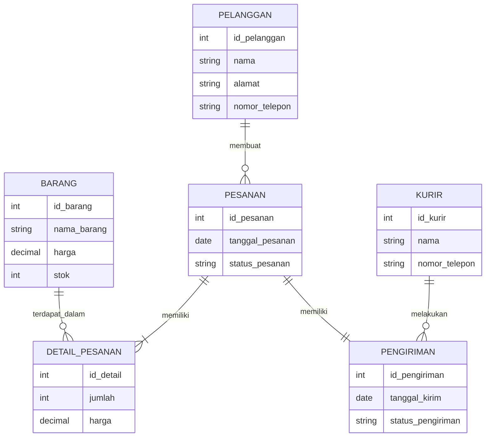

```mermaid
erDiagram
    PELANGGAN ||--o{ PESANAN : membuat
    PESANAN ||--|{ DETAIL_PESANAN : memiliki
    BARANG ||--o{ DETAIL_PESANAN : terdapat_dalam
    KURIR ||--o{ PENGIRIMAN : melakukan
    PESANAN ||--|| PENGIRIMAN : memiliki

    PELANGGAN {
        int id_pelanggan
        string nama
        string alamat
        string nomor_telepon
    }
    PESANAN {
        int id_pesanan
        date tanggal_pesanan
        string status_pesanan
    }
    DETAIL_PESANAN {
        int id_detail
        int jumlah
        decimal harga
    }
    BARANG {
        int id_barang
        string nama_barang
        decimal harga
        int stok
    }
    KURIR {
        int id_kurir
        string nama
        string nomor_telepon
    }
    PENGIRIMAN {
        int id_pengiriman
        date tanggal_kirim
        string status_pengiriman
    }
```
