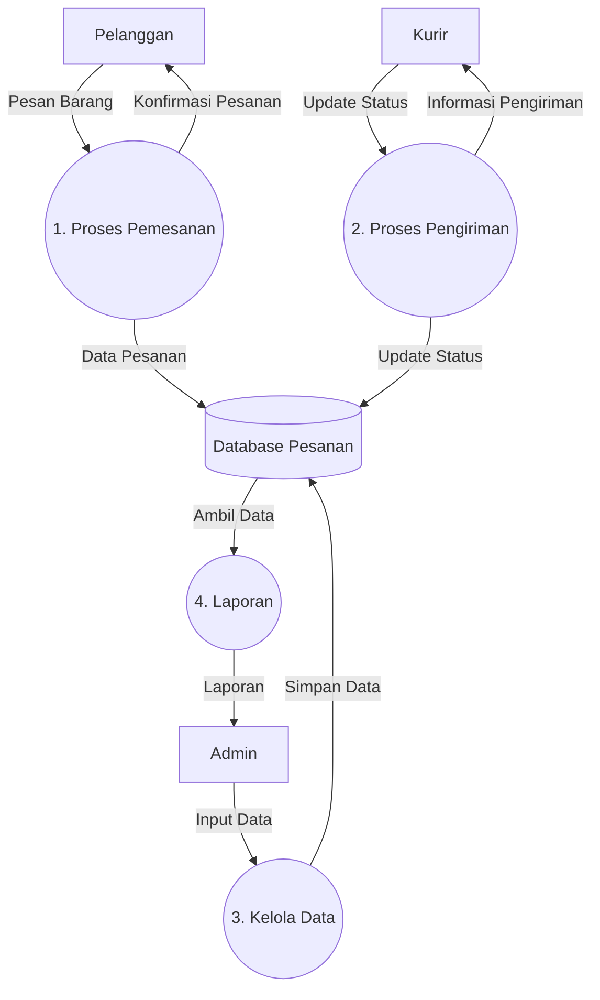

```mermaid
graph TD
    A[Pelanggan] -->|Pesan Barang| B((1. Proses Pemesanan))
    B -->|Konfirmasi Pesanan| A
    B -->|Data Pesanan| E[(Database Pesanan)]
    C[Kurir] -->|Update Status| F((2. Proses Pengiriman))
    F -->|Informasi Pengiriman| C
    F -->|Update Status| E
    D[Admin] -->|Input Data| G((3. Kelola Data))
    G -->|Simpan Data| E
    E -->|Ambil Data| H((4. Laporan))
    H -->|Laporan| D
```
