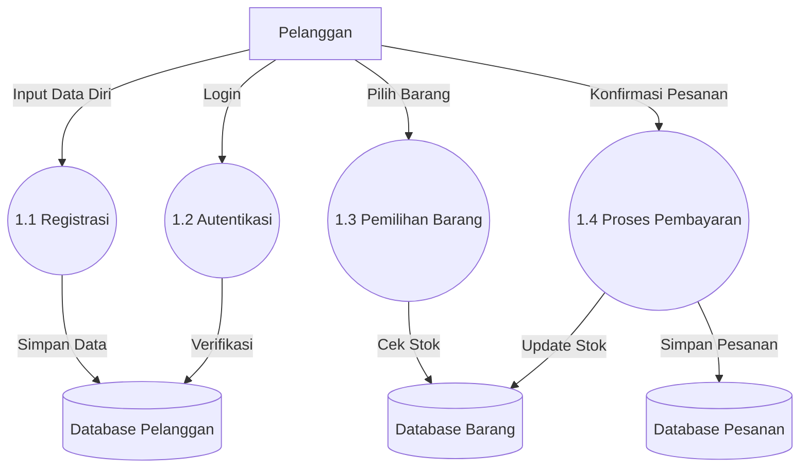

```mermaid
graph TD
    A[Pelanggan] -->|Input Data Diri| B((1.1 Registrasi))
    B -->|Simpan Data| E[(Database Pelanggan)]
    A -->|Login| C((1.2 Autentikasi))
    C -->|Verifikasi| E
    A -->|Pilih Barang| D((1.3 Pemilihan Barang))
    D -->|Cek Stok| F[(Database Barang)]
    A -->|Konfirmasi Pesanan| G((1.4 Proses Pembayaran))
    G -->|Update Stok| F
    G -->|Simpan Pesanan| H[(Database Pesanan)]
```
